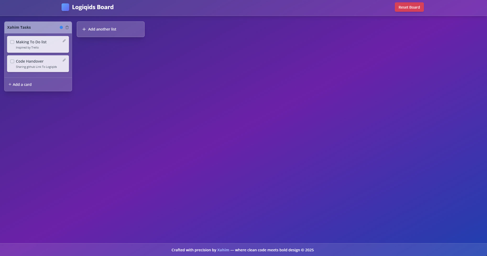
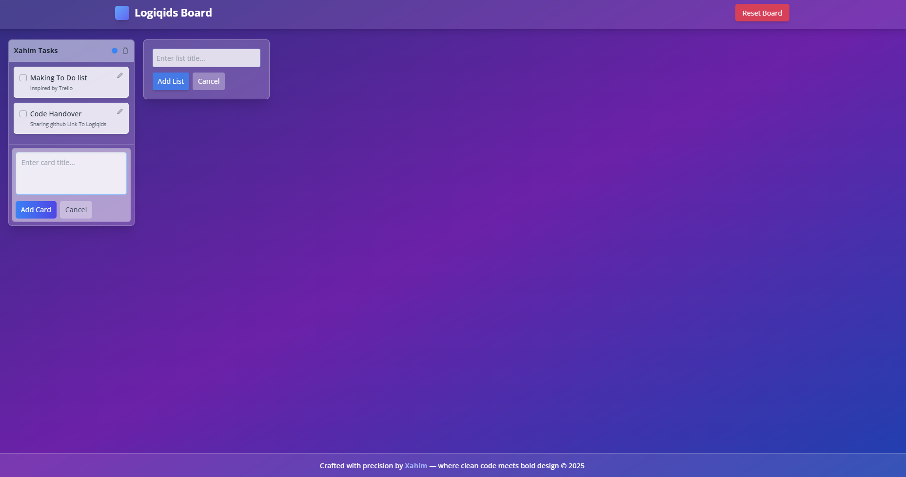

🧩 Trello-Like Task Board (React/Next.js)
A fully interactive Trello-style task management board with drag-and-drop support, persistent local state, and clean responsive UI built using React/Next.js.

🧠 Objective
Create a Trello-like board that allows users to manage tasks by adding, editing, deleting, and rearranging task cards within multiple lists. This project demonstrates:

Drag-and-drop functionality

Dynamic UI state management

Interactive modals and editing

LocalStorage persistence

🖼️ UI Preview

A snapshot of the main board interface

📝 Tip: To add an image like the one above, place the image (e.g., preview.png) in the public folder of your Next.js project and use the following syntax:

markdown
Copy
Edit

🎯 Features
🔹 Board Layout
Header:

Logo or title

"Reset Board" button to clear all data

Board Area:

Horizontally scrollable layout of draggable lists

Lists contain draggable task cards

Footer (optional):

App info or developer credits

🔹 List Functionality
Add, rename, or delete a list

Lists are draggable for reordering

🔹 Card Functionality
Add, edit, or delete a card

Each card contains:

Title

Modal for editing title, description, and due date

Cards are draggable across or within lists

🔹 Drag-and-Drop
Cards: Reorder or move between lists

Lists: Reorder across board

🔹 Local Persistence
All board data is stored in localStorage

Automatically reloads your data on refresh